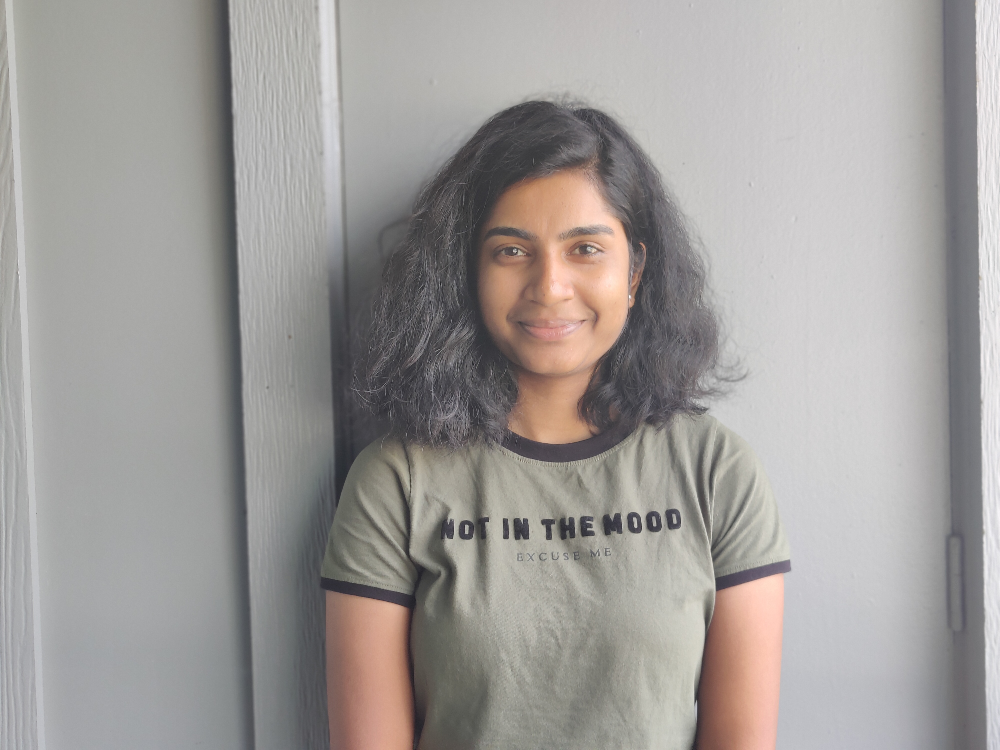

# Priyaanka Reddy Boothkuri

## Biography
I am currently pursuing a Master of Science in **Business Analytics and Information Systems** at the University of South Florida. My academic journey has equipped me with a solid foundation in Big Data technologies and analytics, along with hands-on experience in data visualization and machine learning. Previously, I worked as a Software Engineer at Fractal Analytics, where I developed dashboards and optimized data retrieval processes. I am passionate about leveraging data to drive decision-making and enhance operational efficiency.

